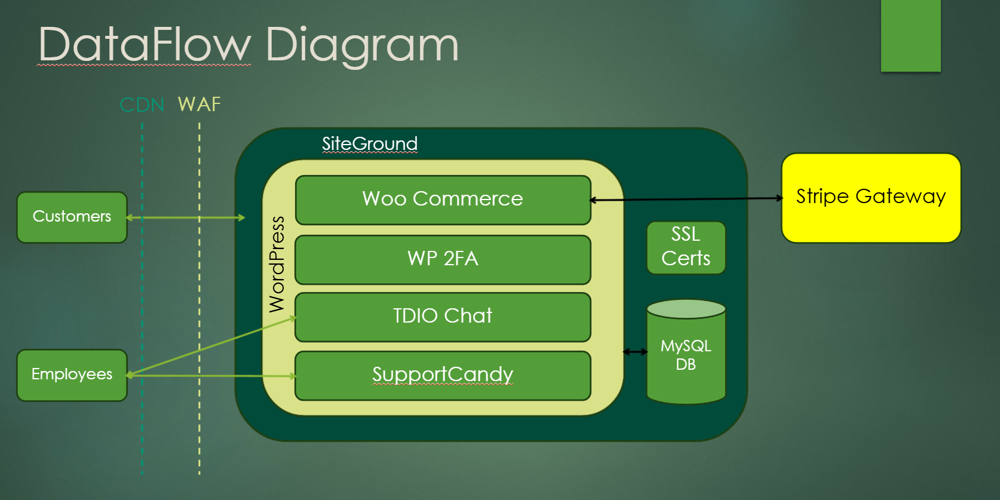

# CSCE-5560-Project-Source
This is an XML file that contain the entire information about our website.
The website is Cybexconsulting.com.
The website is hosted using Siteground and wordpress.
The plugins are: 
  JetPack – Backups, WAF, monitoring, and more ​
  Woo Commerce – Product Management, Cart, Checkout​ 
  Stripe – Payment Gateway​ 
  WP 2FA – Enforces 2FA for all users ​
  Tidio Chat – AI Chatbot​ 
  SupportCandy – Service Tickets for customer support ​
  Customer Email Verification for WooCommerce ​

Below are the setup of the file: 
​  Hosted on SiteGround with Security Optimizer ​
  Using WordPress ​
  MySQL DB​ 
  SSL enabled, HTTPS enforced​ 
  WAF enabled​ 
  CDN enabled​ 
  MFA enforced ​
  Role Based Access Management​ 
  Wp-admin login URL protected ​
  Admin email alerts ​
  Email included 
Dataflow Diagram:

